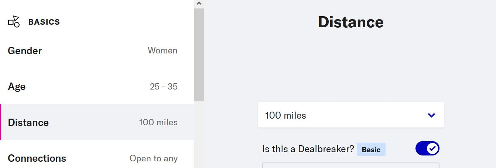

[OkCupid](https://www.okcupid.com) is great!

One things that annoys me a little though,
is that I often get matches for **people too far away** from where I live,
even with the **distance filter** set in my _Settings_:

Hence I wrote some simple Javascript code that **auto-pass matches for a list of given cities**.

    
Javascript snippet

    <pre><code>const CITIES = 'London,Paris';
function autoPassCities() {
    const loc = document.getElementsByClassName('card-content-header__location')[0].textContent;
    if (CITIES.split(',').some(city => loc.endsWith(city))) {
        console.log('AutoPass:', loc);
        document.getElementsByClassName('pass')[0].click();
    }
    setTimeout(autoPassCities, 500);
}
autoPassCities();</code></pre>

You can generate **your own [bookmarklet](https://en.wikipedia.org/wiki/Bookmarklet)**
for the cities you wish to exclude
on this page: <https://lucas-c.github.io/okcupid-auto-pass-cities/>
